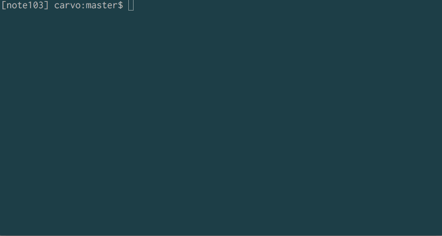
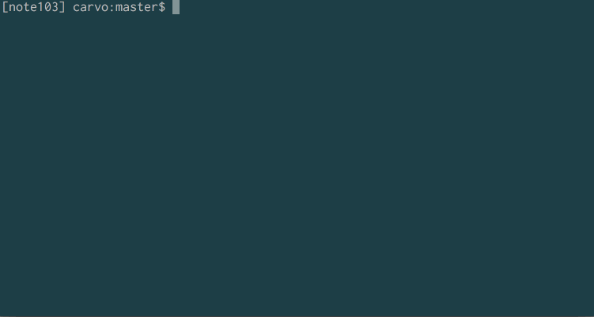

# NAME

choco - Move around directories and files intuitively.

# DESCRIPTION

直感的な操作でファイル／ディレクトリを操作します。

# DEMO

### move by cho


### move by peco (using open command)


# Installation

1) Download a repogitory or the script 'choco.pl'.

2) Edit .bashrc

```bash
function dirmove {
    local result="$1"
    local basename=""
    local dirname=""

    if [ -e "$result" ]; then
        basename=${result##*/}
        if [ -f "$result" ]; then
            dirname="${result%%$basename}"
        elif [ -d "$result" ]; then
            dirname="$result"
        fi
    fi
    cd "$dirname"
}

function choco {
    local command="${@:$#}"
    local result=$(perl ~/path/to/choco/choco.pl "$@")

    if  [ $# = 0 ] || [ "$command" = "-p" ] || [ "$command" = "-a" ]; then
        command=echo
    fi

    if  [ -e "$result" ]; then
        dirmove "$result"
    fi
    $command $result
}
```

3) Add alias (example)

```bash
alias s=choco
alias s.="choco -a"
alias j="choco -p open"
alias j.="choco -ap open"

# `open` command is for Mac only.
```

# REQUIREMENT

- [cho](https://github.com/mattn/cho)
- [peco](https://github.com/peco/peco)

# LICENSE

Copyright (C) Hiroaki Kadomatsu.  
This library is free software; you can redistribute it and/or modify it under the same terms as Perl itself.

# AUTHOR

Hiroaki Kadomatsu (@note103)

- [Blog](http://note103.hateblo.jp/)
- [Twitter](https://twitter.com/note103)
